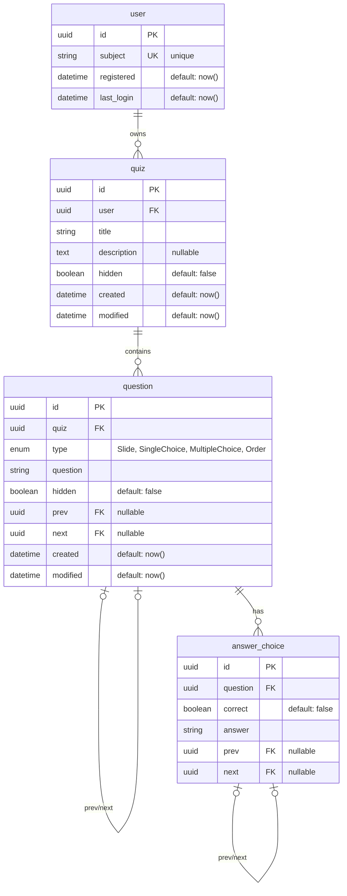

# Benjrm
> /ˈbɛndʒəmɪn/ – a quiz platform for interactive learning and live competition


We're currently building this project. Stay tuned for updates in the coming days.

## Development environment

For a complete development environment with hot reload for the frontend and test users, create an `.env` file based on `.env.example` and run:
```
docker compose -f compose.dev.yaml up --build
```

> On Linux hosts, the development image can be built with the local user UID/GID so bind-mounted files stay writable inside the container:
> 
> ```shell
> UID=$(id -u) GID=$(id -g) docker compose -f compose.dev.yaml up --build
> ```

### Test users

Admin user: admin, password: admin

> This credentials can be configured using the `KC_BOOTSTRAP_ADMIN_USERNAME` and `KC_BOOTSTRAP_ADMIN_PASSWORD` environment variables.

| Username   | Password |
| ---------- | -------- |
| demo-admin | password |
| user       | password |
| simon      | password |

> These users are configured in [services/identity-provider/mounts/init.sh](services/identity-provider/mounts/init.sh).

## Setup

### Configuration

Create an `.env` file based on `.env.example`. You should at least change:
- `DATABASE_PASSWORD`
- `DOMAIN`
- `PUBLIC_URL`
- `OIDC_CLIENT_SECRET`
- `OIDC_PUBLIC_IDP_URL`
- `KC_DB_PASSWORD`

### Reverse proxy

By default, this project uses traefik as reverse proxy. You can set up traefik using default configuration by following [docs/traefik/README.md](docs/traefik/README.md) or you can use your own traefik instance. If you don't want to use traefik at all, remove all `networks` and `labels` sections from `compose.yaml`.

### Run

```
docker compose up --build
```

Keycloak admin user: admin, password: admin

> This credentials can be configured using the `KC_BOOTSTRAP_ADMIN_USERNAME` and `KC_BOOTSTRAP_ADMIN_PASSWORD` environment variables.

After starting this the first time, you should log into the Keycloak admin interface, create a new admin user and remove the existing one.

> If you are using traefik and haven't modified the host rules in `compose.yaml`, the Keycloak URL is "idp.<YOUR_DOMAIN>".

1. Log into the Keycloak admin interface using username: admin and password: admin (or your customized bootstrap credentials)
2. Go to "Users" -> "Add user"
3. Enter a username and click on "Create"
4. Go to "Role mapping" -> "Assign role" -> "Realm roles"
5. Select "admin" and click on "Assign"
6. Go to "Credentials" and click on "Set password"
7. Enter a secure password, uncheck "Temporary" and click on "Save"
8. Sign out and sign in using the new admin user
9. Go to "Users", select the initial admin user and click on "Delete user"
10. Edit `.env` and remove or comment out `KC_BOOTSTRAP_ADMIN_USERNAME` and `KC_BOOTSTRAP_ADMIN_PASSWORD`

### Use other identity provider than the one shipped in `compose.yaml`

If you don't want to use the identity provider shipped with this project, you can configure any identity provider that supports openid connect in the `.env` file.

:warning: **BUT:** you should **NOT** use any identity provider outside of your trusted environment. Due to security vulnerablilities ([RUSTSEC-2026-0098](https://rustsec.org/advisories/RUSTSEC-2026-0098), [RUSTSEC-2026-0099](https://rustsec.org/advisories/RUSTSEC-2026-0099), [RUSTSEC-2026-0104](https://rustsec.org/advisories/RUSTSEC-2026-0104)) an attacker might provide an ssl-certificate that's not valid for your idp's domain but is accepted. :warning:

## Why Benjrm

Each letter represents one of the creators. Together, it forms a name that is pronounced like "Benjamin". Represented using the International Phonetic Alphabet as /ˈbɛndʒəmɪn/

## API
Please refer to the [API-related documentation](docs/api/README.md).

## Technology Stack

To get more insights into Benjrm's technology stack, please refer to the [Technology Stack Documentation](docs/decisions/README.md).

## CI/CD Pipeline documentation
Please refer to the [CI/CD Pipeline Documentation](docs/ci-cd/README.md).

## Database Scheme


