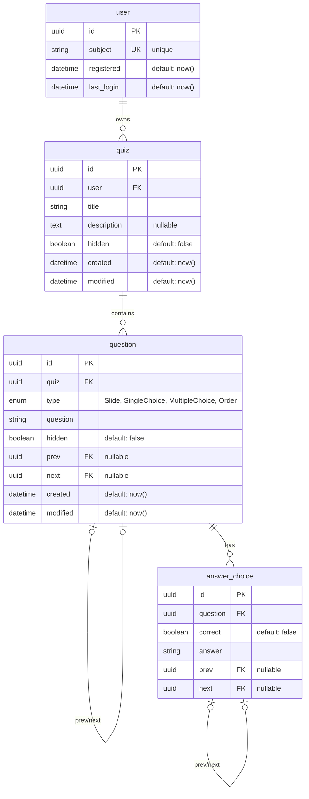

# Benjrm
> /ˈbɛndʒəmɪn/ – a quiz platform for interactive learning and live competition


We're currently building this project. Stay tuned for updates in the coming days.

## Development environment

For a complete development environment with hot reload for the frontend and test users, create an `.env` file based on `.env.example` and run:
```
docker compose -f compose.dev.yaml up --build
```

> On Linux hosts, the development image can be built with the local user UID/GID so bind-mounted files stay writable inside the container:
> 
> ```shell
> UID=$(id -u) GID=$(id -g) docker compose -f compose.dev.yaml up --build
> ```

## Setup

### Configuration

Create an `.env` file based on `.env.example`. You should at least change:
- `DATABASE_PASSWORD` (if using postgreSQL)
- `DOMAIN`
- `PUBLIC_URL`
- `OIDC_CLIENT_SECRET`
- `OIDC_ISSUER_URL`
- `OIDC_PUBLIC_IDP_URL`
- `IDP_STORAGE_KEY`

### Reverse proxy

By default, this project uses traefik as reverse proxy. You can set up traefik using default configuration by following [docs/traefik/README.md](docs/traefik/README.md) or you can use your own traefik instance. If you don't want to use traefik at all, remove all `networks` and `labels` sections from `compose.yaml`.

### Run

```
docker compose up --build
```

> After starting the project, VoidAuth (the identity provider) will log a URL that can be used to reset the admin user's password. The URL is valid for 24 hours.
>
> If you don't care about the VoidAuth admin account and only want to use Benjrm, you can simply ignore it. Everything is already configured, and users can register without admin approval unless this has been configured differently in the compose or `.env` file.

### Use other identity provider than the one shipped in `compose.yaml`

If you don't want to use the identity provider shipped with this project, you can configure any identity provider that supports openid connect in the `.env` file.

:warning: **BUT:** you should **NOT** use any identity provider outside of your trusted environment. Due to security vulnerablilities ([RUSTSEC-2026-0098](https://rustsec.org/advisories/RUSTSEC-2026-0098), [RUSTSEC-2026-0099](https://rustsec.org/advisories/RUSTSEC-2026-0099), [RUSTSEC-2026-0104](https://rustsec.org/advisories/RUSTSEC-2026-0104)) an attacker might provide an ssl-certificate that's not valid for your idp's domain but is accepted. :warning:

## Why Benjrm

Each letter represents one of the creators. Together, it forms a name that is pronounced like "Benjamin". Represented using the International Phonetic Alphabet as /ˈbɛndʒəmɪn/

## API
Please refer to the [API-related documentation](docs/api/README.md).

## Technology Stack

To get more insights into Benjrm's technology stack, please refer to the [Technology Stack Documentation](docs/decisions/README.md).

## CI/CD Pipeline documentation
Please refer to the [CI/CD Pipeline Documentation](docs/ci-cd/README.md).

## Database Scheme


```mermaid
erDiagram
    user {
        uuid id PK
        string subject UK "unique"
        datetime registered "default: now()"
        datetime last_login "default: now()"
    }
    quiz {
        uuid id PK
        uuid user FK
        string title
        text description "nullable"
        boolean hidden "default: false"
        datetime created "default: now()"
        datetime modified "default: now()"
    }
    question {
        uuid id PK
        uuid quiz FK
        enum type "Slide, SingleChoice, MultipleChoice, Order"
        string question
        boolean hidden "default: false"
        uuid prev FK "nullable"
        uuid next FK "nullable"
        datetime created "default: now()"
        datetime modified "default: now()"
    }
    answer_choice {
        uuid id PK
        uuid question FK
        boolean correct "default: false"
        string answer
        uuid prev FK "nullable"
        uuid next FK "nullable"
    }

    user ||--o{ quiz : "owns"
    quiz ||--o{ question : "contains"
    question ||--o{ answer_choice : "has"
    question |o--o| question : "prev/next"
    answer_choice |o--o| answer_choice : "prev/next"
```
