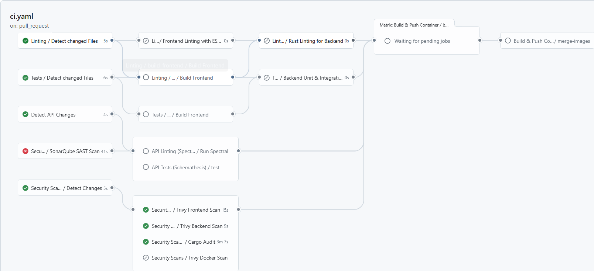

# CI/CD Pipeline Documentation
This section describes how our CI/CD pipeline is structured and how the individual workflows and tasks are linked together. It also explains why these individual steps are necessary and how they are used.

## The Main Pipeline ([`ci.yaml`](../../.github/workflows/ci.yaml))
The [`ci.yaml`](../../.github/workflows/ci.yaml) file serves as the central entry point workflow, which controls the individual workflows. The exception here is the [`githubpages.yaml`](../../.github/workflows/githubpages.yaml) workflow.

This central control of the other workflows is necessary to reduce code duplication and ensure clear execution.
The pipeline ensures that every code change goes through a standardized set of quality and security checks, which is why it runs as soon as something is pushed to the `main` branch or the `release/**` branch. Creating a version tag (e.g., v1.0.0) as well as opening and modifying a pull request also trigger the pipeline. For better testing, there is also the option to manually trigger it using `workflow_dispatch`.

To save time and resources, all workflows that are currently running for the same branch or tag are terminated. 

### Pipeline Structure

An example of this Pipeline with all successful checks can be seen [here](https://github.com/Benjrm/Benjrm/actions/runs/28535992259).

To avoid unnecessary runtime for API tests, we check whether the [OpenAPI](../openapispec) or [AsyncAPI](../asyncapi) specifications have changed at all. If there are no changes, we do not need to retest the API. However, if changes have occurred, the corresponding API test and API documentation workflows are executed. This ensures that our API documentation and functionality are always up to date.

Furthermore, every time the pipeline is triggered, we perform our standard quality and security checks (linting, security, and tests) by invoking and running the corresponding workflows.

Finally, provided that all security and quality tests were successful and it is not a pull request, our application is built as a container. This prevents us from deploying faulty or insecure code as a container.

## Frontend Build ([`build_frontend.yaml`](../../.github/workflows/build_frontend.yaml))
This workflow has a modular structure and is called by other pipelines ([`lint.yaml`](../../.github/workflows/lint.yaml) and [`tests.yaml`](../../.github/workflows/tests.yaml)).
Delegating this task saves us a lot of time and resources, as we would only need to build the frontend once and could reuse it thanks to caching.

To ensure stable and secure builds, we use `npm ci`, which installs exactly the versions specified in [`package-lock.json`](../../frontend/package-lock.json). We then build the frontend using `npm run build`, and finally, this workflow uploads the generated `dist` folder as an artifact to GitHub. We use this artifact to access the finished frontend in other workflows (`linting`, `backend tests`).

## Code Quality and Security Workflows ([`lint.yaml`](../../.github/workflows/lint.yaml), [`security.yaml`](../../.github/workflows/security.yaml))
In this step, the code is checked. It is checked for typing errors. It is also checked for proper formatting. This is done to ensure that the code is consistent and easy to read.

Before the pipeline begins linting the frontend and backend, it checks whether and where (backend or frontend) changes have actually been made. This reduces runtime, since the frontend only needs to be checked if changes have been made to the frontend as well. The same applies to the backend.

For linting, we use [`eslint`](../../frontend/eslint.config.js) for the frontend and `cargo clippy` for our backend, which is written in Rust.

When it comes to the frontend job, we first run a type check using the command `npm run type:check`. This checks our TypeScript code for type errors. We then run the linting and formatting checks using `npm run lint`.

For the backend, we first need to load our frontend build artifact from the [`build_frontend.yaml`](../../.github/workflows/build_frontend.yaml) workflow, since our backend serves the frontend directly and requires it for the next steps. We then run the linter for the Rust code and tests using `cargo clippy`. We also check the code formatting with `cargo fmt --all --check`, which ensures that the Rust code is consistent.

## Security Scan ([`security.yaml`](../../.github/workflows/security.yaml))
This workflow automatically performs security scans, including static analysis (SAST) and vulnerability scans. This pipeline step is essential for ensuring continuous security in our application, as it detects vulnerabilities in our code and libraries, as well as misconfigurations, at an early stage and notifies us of them.

We trigger the security workflow each time via the [ci.yaml](../../.github/workflows/ci.yaml) file. However, to maintain an efficient and fast pipeline, SonarQube is run every time, while the Trivy Frontend/Backend & Cargo audits are always triggered by a pull request or push to the main branch. On other branches, these are only run if the dependencies have changed.
The Trivy Docker scan is only run if the Docker files ([Dockerfile](../../Dockerfile), [compose.yaml](../../compose.yaml)) have changed.

We use SonarQube for the SAST scan.
The purpose of this step is to thoroughly scan our source code for security issues, bugs, and "code smells". We have this set to `continue-on-error: true` because the SonarQube server hosted by THM constantly throws a timeout error. However, to ensure our application can be built as a container in the [`build_push_container.yaml`](../../.github/workflows/build_push_container.yaml) workflow, this error should not further affect our pipeline. Nevertheless, to maintain the security of our app, we have set up the SonarQube Cloud Bot.

To search for vulnerabilities in our code, we use Trivy, which scans our project for incorrect configurations and outdated dependencies. Trivy is configured in [`trivy.yaml`](../../trivy.yaml) and is set up to scan for secrets in addition to misconfigurations and security vulnerabilities. We also use Trivy to scan our Docker configuration.

We ensure the security of the backend using `Cargo Audit` (which checks [`Cargo.toml`](../../backend/Cargo.toml) for known vulnerabilities).

## Unit Tests ([`tests.yaml`](../../.github/workflows/tests.yaml))
Our automated tests are currently limited to backend unit tests. We currently rely on manual reviews for frontend testing.
The [`tests.yaml`](../../.github/workflows/tests.yaml) workflow ensures that our backend functions as expected and that existing features have not been broken by new ones. To conserve time and resources, this workflow only runs the backend test when changes have been made to the backend.

The workflow downloads the frontend build artifact before testing, since the backend delivers our frontend as part of the build. In the next step, the backend is then tested using `cargo test --all-features` for the debug build and `cargo test --all-features --release` for the release build.

## Build and Push Container ([`build_push_container.yaml`](../../.github/workflows/build_push_container.yaml))
In this step, the application is containerised to ensure consistent and reliable execution across all target systems (servers, the cloud and developer machines), eliminating the need for each user to manually build the container locally. This process forms a central part of our continuous deployment strategy.

The image is stored at [`ghcr.io/benjrm/benjrm`](https://github.com/Benjrm/Benjrm/pkgs/container/benjrm) in the GitHub Container Registry (GHCR). This acts as a central repository from which production servers retrieve the finished release for execution. In the future, we plan to retrieve the image from there to deploy it directly to a server that we will host ourselves.

This workflow builds for multiple architectures so that our application can be hosted on as many devices as possible. To do this, the `build-push` job uses a build matrix for various platforms (e.g. linux/amd64, arm64, 386, arm/v7). This ensures that the container runs flawlessly on both classic Intel/AMD servers and modern ARM architectures (such as AWS Graviton, Raspberry Pi, or Apple Silicon).

The system can automatically identify whether the target is Alpine (for musl) or Debian-Slim. This enables us to optimise the size of the containers and ensure compatibility during Rust compilation.

Initially, only the digests (hashes) of the individual architectures are pushed and stored as GitHub artifacts. This intermediate step prevents race conditions during the push and prepares for the subsequent merging of the image manifests.

After the individual architectures have been built, the `merge-images` job handles the finalization, during which the tags are dynamically created (`dev` for the main branch, SemVer and `latest` for releases). This versioning system makes it possible to trace the executed code and to roll back to older versions (e.g. v1.0.0). Releases must be created manually on GitHub.

At the end of the workflow, `docker buildx imagetools create` is used to merge all previously created architectures into a multi-architecture manifest. This allows users to simply select `benjrm/benjrm:latest`, after which Docker automatically selects the image suitable for the respective processor.

## API Validation & Testing ([`spectral.yaml`](../../.github/workflows/spectral.yaml), [`schemathesis.yaml`](../../.github/workflows/schemathesis.yaml))
To ensure that our API specifications are syntactically correct and that our backend implementation matches them, we use two separate workflows. These are both triggered by the [`ci.yaml`](../../.github/workflows/ci.yaml) workflow.

1. **API Validation (Spectral):** We use Spectral to enforce style guides and lint our OpenAPI and AsyncAPI specifications. For more detailed information on how Spectral is integrated and how to view its results, please check out the [API documentation](../api/README.md#integrated-into-ci-pipeline).
2. **API Testing (Schemathesis):** We use Schemathesis to test the features of our API. This workflow uses Docker Compose to create a temporary test environment and generates test requests based on our OpenAPI specification to verify the backend's behavior. If you want more details about how Schemathesis is integrated, check out the [API documentation](../api/README.md#integrated-into-ci-pipeline-1).

Both workflows are only executed when changes are made to the API specifications to save time and resources.

## Documentation Deployment ([`githubpages.yaml`](../../.github/workflows/githubpages.yaml))
This workflow deploys our API documentation to GitHub Pages. It runs separately to the main pipeline and is triggered any time changes are pushed to the `main` branch that affect the documentation files in the `docs/` directory.

The deployment process consists of:
1. **OpenAPI (REST):** Publish the Swagger UI files and the OpenAPI specification. For more details, see the [OpenAPI Deployment Documentation](../api/README.md#api-documentation-with-swagger-ui-deployed-to-github-pages).
2. **AsyncAPI (WebSockets):** We use the `@asyncapi/cli` to generate an HTML documentation from our AsyncAPI specification. For more details, see the [WebSocket Deployment Documentation](../api/README.md#websocket-documentation-with-asyncapi-deployed-to-github-pages).

Once we have all of the files, we package them up and deploy them using GitHub Actions directly to our GitHub Pages environment.

## CI/CD Environment Secrets & Variables

To run the CI/CD pipeline successfully, several secrets and variables need to be configured in the GitHub repository.

### Secrets
* `GITHUB_TOKEN`: This is a built-in token automatically provided by GitHub. The [`build_push_container.yaml`](../../.github/workflows/build_push_container.yaml) workflow uses this secret to authenticate with the GitHub Container Registry (GHCR) so we can push our finished Docker images.
* `SONAR_TOKEN`: This token contains the authentication token for our SonarQube instance. This is required in the [`security.yaml`](../../.github/workflows/security.yaml) workflow to perform the SAST scan.

### Variables
* `SONAR_HOST_URL`: The URL where our SonarQube server is reachable.
* `SONAR_PROJECT_KEY`: The unique project key for our project in SonarQube.

### Environments
* **Local `.env` for API Testing:** When the Schemathesis API tests are running, the pipeline automatically copies the `.env.example` file to the `.env` file. This allows that the Docker Compose stack can start up without any real secrets having to be exposed in the pipeline environment.
