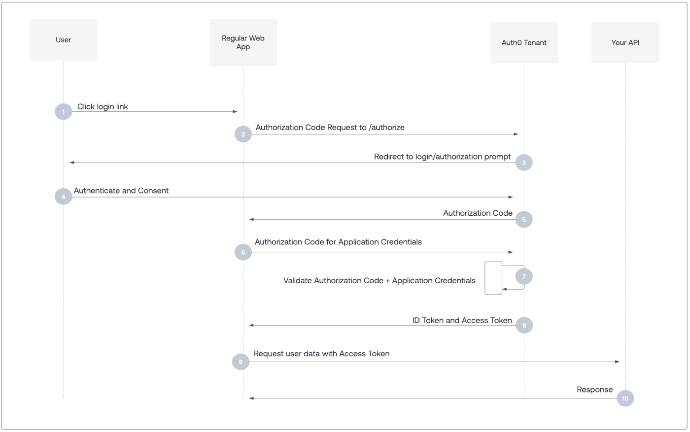
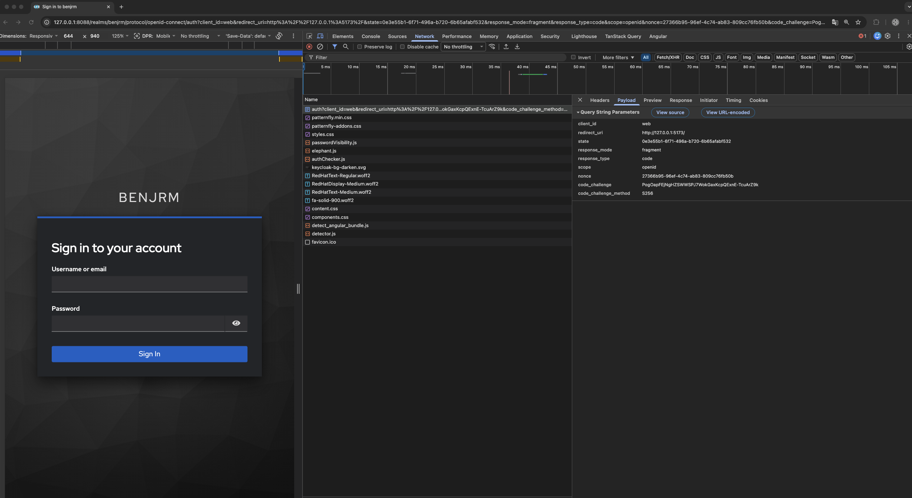
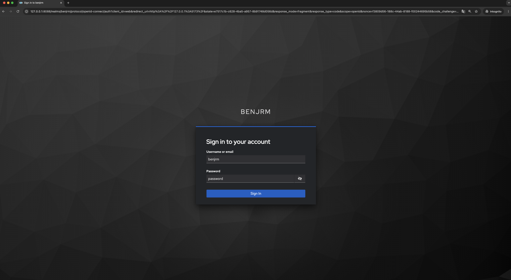
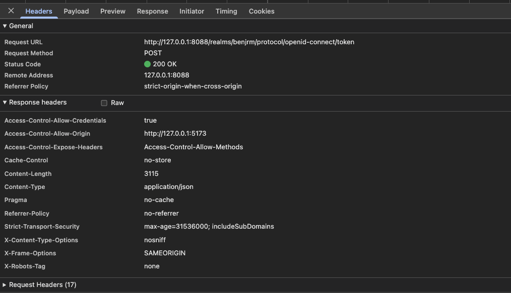
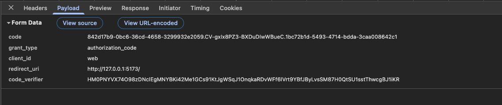
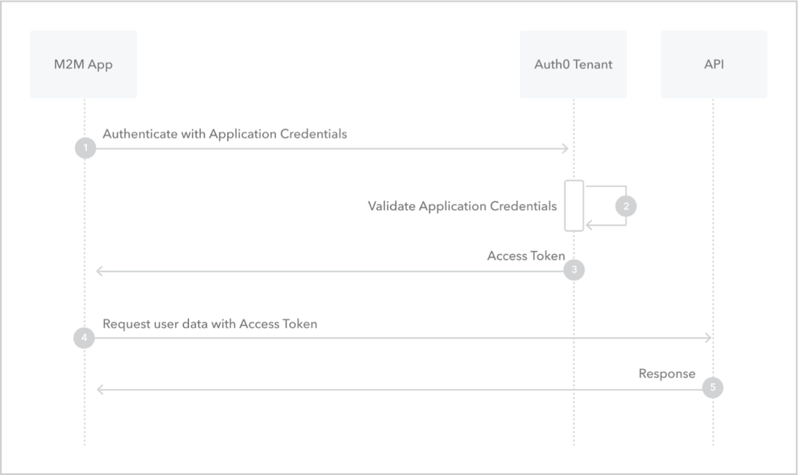
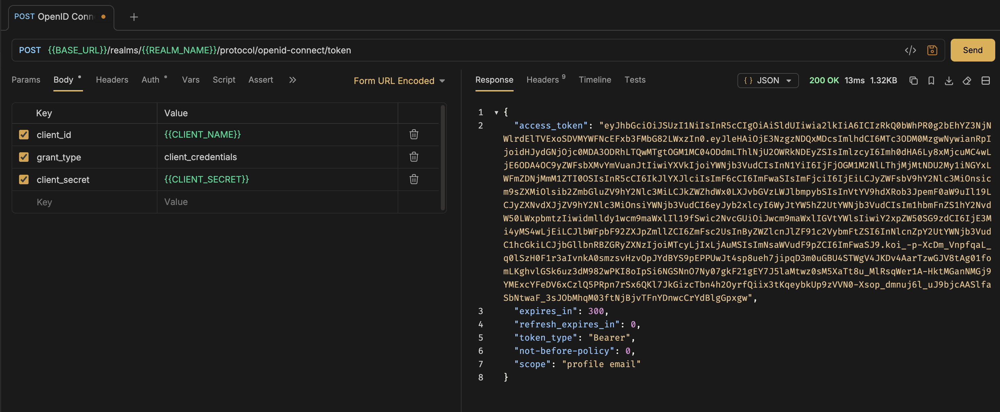

# Identity Provider - Keycloak
1. [JSON Schema for Keycloak Import/Export - GitHub Repository](https://github.com/jirutka/keycloak-json-schema)
2. [JSON Schema for Keycloak Import/Export - Schemas](https://jirutka.github.io/keycloak-json-schema/)
3. [JSON Schema for Keycloak Import/Export - Keycloak Version 26](assets/keycloak-realm-26.json)
4. [All configuration options for Keycloak](https://www.keycloak.org/server/all-config)
5. [Observability - Health Check endppints](https://www.keycloak.org/observability/health)
6. [Securing applications and services with OpenID Connect](https://www.keycloak.org/securing-apps/oidc-layers)
7. [Authorization Code Flow](https://auth0.com/docs/get-started/authentication-and-authorization-flow/authorization-code-flow)
8. [Authorization Code Flow with Proof Key for Code Exchange (PKCE)](https://auth0.com/docs/get-started/authentication-and-authorization-flow/authorization-code-flow-with-pkce)
9. [Client Credentials Code Flow](https://auth0.com/docs/get-started/authentication-and-authorization-flow/client-credentials-flow)

## Realm Configuration
1. **"realm": "benjrm"** - 
A realm manages a set of users, credentials, roles, and groups.
A user belongs to and logs into a realm.
Realms are isolated from one another and can only manage and authenticate the users that they control.
2. **"enabled": true** -
Disabled realms cannot be accessed or used for authentication, and users within the realm cannot log in or perform any actions until the realm is enabled again.
2. **"sslRequired": "external"** - 
localhost (via 127.0.0.1.) and private IP addresses can access without HTTPS but all other requests must use HTTPS.

## Client Configuration
## Client-side Web Application of Benjrm
Uses **OpenID Connect (OIDC)** **Standard Flow (Authorization Code Flow) with PKCE (Proof Key for Code Exchange)**
to authenticate users and obtain access tokens for accessing protected resources.
---
### 🔐 Authorization Code Flow with Proof Key for Code Exchange (PKCE) - Step-by-Step

#### 👉Authentication Code Flow Sequence Diagram:

[Authorization Code Flow - Further explanations](https://auth0.com/docs/get-started/authentication-and-authorization-flow/authorization-code-flow)

#### 👉Authentication Code Flow Sequence Diagram with Proof Key for Code Exchange (PKCE):

[Authorization Code Flow with Proof Key for Code Exchange (PKCE) - Further explanations](https://auth0.com/docs/get-started/authentication-and-authorization-flow/authorization-code-flow-with-pkce)

1. The user clicks the **"Login"** button on the client-side web application. 
2. This step consists of the steps 2, 3 and 4 of the Authentication Code Flow with PKCE sequence diagram. 
The client-side application generates a random `state`, `nonce`, `code_verifier` and derives a `code_challange` from the `code_verifier` using a secure transformation (e.g. SHA-256). 
The client-side application then sends an authorization code request to Keycloak's authorization endpoint:

```
{BASE_URL}/realms/{REALM_NAME}/protocol/openid-connect/auth
```

with the following query parameters:
- `client_id`: The registered client identifier of the application (e.g. `web`)
- `redirect_uri`: URL where Keycloak redirects after successful authentication (e.g. `http://127.0.0.1:5173/`)
- `response_mode`: Defines how the result is returned, typically `fragment` for SPA applications
- `response_type`: Defines the OAuth2 flow type, must be `code` (Authorization Code Flow)
- `scope`: Defines requested permissions, typically `openid` for OpenID Connect authentication
- `state`: Random string used to prevent CSRF attacks and to maintain request state between redirect
- `nonce`: Random value used to prevent token replay attacks in ID tokens
- `code_challenge`: PKCE challenge value derived from a code verifier (used for securing public clients)
- `code_challenge_method`: Must be `S256` for SHA-256 based PKCE transformation

👉 Example:



---

3. The user authenticates on the Keycloak login page by entering and submitting their credentials.


---

4. After successful authentication, Keycloak redirects the user back to the application with an authorization code:

```
http://localhost:5173?code=XYZ
```

---

5. This step consists of the steps 7, 8, 9 of the Authentication Code Flow with PKCE sequence diagram. 
The application exchanges the authorization code for tokens by sending a **POST request** to the token endpoint:

```
{BASE_URL}/realms/{REALM_NAME}/protocol/openid-connect/token
```

with:
- `code=XYZ` (the authorization code received in the previous step)
- `grant_type=authorization_code` (indicates the type of OAuth2 flow being used - Authorization Code Flow)
- `client_id=web` (the  registered client identifier of the application)
- `redirect_uri=http://localhost:5173/` (must match the redirect URI used in the authorization request)
- `code_verifier`(the original random string generated by the client-side application, used to verify the PKCE challenge by hashing it and comparing it to the `code_challenge` sent in the authorization request)

👉 Example:





6. Afterward the client-side application can request protected resources from the API by including the JSON Web Token (JWT) access token in the `Authorization` header of the http request.
The API will validate the access token with Keycloak's token introspection endpoint
```
{BASE_URL}/realms/{REALM_NAME}/protocol/openid-connect/token/introspect
```
or by verifying the token signature and claims locally using Keycloak's public keys.

---

## Server-side API of Benjrm
Uses **OpenID Connect (OIDC)** **Client Credentials Flow** to authenticate itself to Keycloak and obtain
access tokens for accessing protected resources on behalf of itself (not on behalf of a user).

### 🔐 Client Credentials Code Flow - Step-by-Step

#### 👉Client Credentials Code Flow Sequence Diagram:

[Client credentials code flow - Further explanations](https://auth0.com/docs/get-started/authentication-and-authorization-flow/client-credentials-flow)

1. The server-side application sends a **POST** request to the Keycloak token endpoint:

```
{BASE_URL}/realms/{REALM_NAME}/protocol/openid-connect/token
```
with the following application/x-www-form-urlencoded body parameters:
- `client_id`: The registered client identifier of the application (e.g. `api`).
- `grant_type`: Must be `client_credentials` for this flow.
- `client_secret`: The secret associated with the client.

👉 Example of Requesting an Access Token using Client Credentials Flow:


2. Keycloak validates the client credentials and responds with an access token if the authentication is successful.

3. The server-side application can then use the access token to authenticate itself when making requests to protected resources,
by including the token in the `Authorization` header of the HTTP request as a Bearer token: