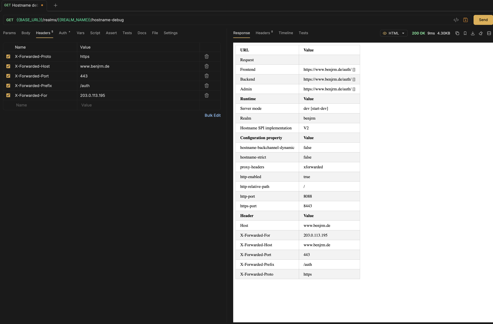

# Identity Provider - Keycloak
1. [JSON Schema for Keycloak Import/Export - GitHub Repository](https://github.com/jirutka/keycloak-json-schema)
2. [JSON Schema for Keycloak Import/Export - Schemas](https://jirutka.github.io/keycloak-json-schema/)
3. [JSON Schema for Keycloak Import/Export - Keycloak Version 26](assets/keycloak-realm-26.json)
4. [All configuration options for Keycloak](https://www.keycloak.org/server/all-config)
5. [Observability - Health Check endppints](https://www.keycloak.org/observability/health)
6. [Securing applications and services with OpenID Connect](https://www.keycloak.org/securing-apps/oidc-layers)
7. [Authorization Code Flow](https://auth0.com/docs/get-started/authentication-and-authorization-flow/authorization-code-flow)
8. [Authorization Code Flow with Proof Key for Code Exchange (PKCE)](https://auth0.com/docs/get-started/authentication-and-authorization-flow/authorization-code-flow-with-pkce)
9. [Client Credentials Code Flow](https://auth0.com/docs/get-started/authentication-and-authorization-flow/client-credentials-flow)

## Exposed Ports:
1. **Port 8088**: Admin UI, Account Console, SAML and OIDC endpoints, Admin REST API. See details about in
[Configuring the hostname (v2)](https://www.keycloak.org/server/hostname)
2. **Port 9000**: [Management interface](https://www.keycloak.org/server/management-interface)
providing [health check endpoints](https://www.keycloak.org/observability/health) and [metrics](https://www.keycloak.org/observability/configuration-metrics)
if enabled in the configuration. Note that only the health check endpoints are currently enabled in the provided Keycloak configuration.
*Note: You should not proxy port 9000 as health checks and metric suse those ports directly, and you do not want to expose this information to external callers.*

## Hostname Configuration
[Configuring the hostname (v2)](https://www.keycloak.org/server/hostname#_using_a_reverse_proxy)

### Using a reverse proxy with edge TLS termination
In the setup we use a reverse proxy with edge TLS termination 
[See details about configuring a reverse proxy for Keycloak](https://www.keycloak.org/server/reverseproxy)

#### Fully dynamic URLs
We chose a fully dynamic URL configuration to ensure maximum flexibility across different environments, specifically development and production. 
Since both environments may differ in domain, protocol, or routing behavior, hardcoding a fixed hostname would introduce unnecessary coupling and reduce portability.

By relying on correctly configured Forwarded headers from the reverse proxy, the application can automatically resolve the correct external URL at runtime. 
This allows the same deployment artifact to be used in both environments without modification, reducing configuration overhead and minimizing the risk of environment-specific misconfigurations.

Additionally, this approach supports modern infrastructure patterns such as containerization and infrastructure-as-code, where environments are expected to be ephemeral or dynamically provisioned. It also simplifies CI/CD pipelines, as no environment-specific hostname configuration is required within the application itself.

Overall, the fully dynamic approach improves maintainability, reduces duplication of configuration, and ensures consistent behavior across development and production environments while delegating URL resolution to the trusted reverse proxy layer.

[Configuring the hostname (v2) - Using a reverse proxy - Fully dynamic URLS](https://www.keycloak.org/server/hostname#_fully_dynamic_urls)


Required http headers for reverse proxy configuration:
1. `X-Forwarded-Proto`: The protocol used by the client to connect to the reverse proxy (e.g. `http` or `https`).
2. `X-Forwarded-Host`: The original host requested by the client in the host http header. (e.g. `www.benjrm.de`).
3. `X-Forwarded-Port`: The port on which the client is connecting to the reverse proxy (e.g. `80 for http`, `443 for https`).
4. `X-Forwarded-Prefix`: The path prefix used by the reverse proxy to route requests to Keycloak (e.g. `/auth`)
5. `X-Forwarded-For`: The original client ip address of the client connecting to the reverse proxy (e.g. `203.0.113.195`).

#### Hostname Debug endpoint with dynamic URL and X-Forwarded-* http headers.

Note: This endpoint is only available when the environment variable `KC_HOSTNAME_DEBUG` is set to `true`.



#### OIDC Configuration endpoints with dynamic URL and X-Forwarded-* http headers


> Note: Take a look at
[Configuring a reverse proxy - Exposed path recommendations](https://www.keycloak.org/server/reverseproxy#_exposed_path_recommendations) and
[Configuring a reverse proxy - Trusted proxies](https://www.keycloak.org/server/reverseproxy#_trusted_proxies) when
configuring the reverse proxy.

## Realm Configuration
1. **"realm": "benjrm"** - 
A realm manages a set of users, credentials, roles, and groups.
A user belongs to and logs into a realm.
Realms are isolated from one another and can only manage and authenticate the users that they control.
2. **"enabled": true** -
Disabled realms cannot be accessed or used for authentication, and users within the realm cannot log in or perform any actions until the realm is enabled again.
2. **"sslRequired": "external"** - 
localhost (via 127.0.0.1.) and private IP addresses can access without HTTPS but all other requests must use HTTPS.

## Client Configuration
## Client-side Web Application of Benjrm
Uses **OpenID Connect (OIDC)** **Standard Flow (Authorization Code Flow) with PKCE (Proof Key for Code Exchange)**
to authenticate users and obtain access tokens for accessing protected resources.
---
### 🔐 Authorization Code Flow with Proof Key for Code Exchange (PKCE) - Step-by-Step

#### 👉Authentication Code Flow Sequence Diagram:


[Authorization Code Flow - Further explanations](https://auth0.com/docs/get-started/authentication-and-authorization-flow/authorization-code-flow)

#### 👉Authentication Code Flow Sequence Diagram with Proof Key for Code Exchange (PKCE):


[Authorization Code Flow with Proof Key for Code Exchange (PKCE) - Further explanations](https://auth0.com/docs/get-started/authentication-and-authorization-flow/authorization-code-flow-with-pkce)

1. The user clicks the **"Login"** button on the client-side web application. 
2. This step consists of the steps 2, 3 and 4 of the Authentication Code Flow with PKCE sequence diagram. 
The client-side application generates a random `state`, `nonce`, `code_verifier` and derives a `code_challange` from the `code_verifier` using a secure transformation (e.g. SHA-256). 
The client-side application then sends an authorization code request to Keycloak's authorization endpoint:

```
{BASE_URL}/realms/{REALM_NAME}/protocol/openid-connect/auth
```

with the following query parameters:
- `client_id`: The registered client identifier of the application (e.g. `web`)
- `redirect_uri`: URL where Keycloak redirects after successful authentication (e.g. `http://127.0.0.1:5173/`)
- `response_mode`: Defines how the result is returned, typically `fragment` for SPA applications
- `response_type`: Defines the OAuth2 flow type, must be `code` (Authorization Code Flow)
- `scope`: Defines requested permissions, typically `openid` for OpenID Connect authentication
- `state`: Random string used to prevent CSRF attacks and to maintain request state between redirect
- `nonce`: Random value used to prevent token replay attacks in ID tokens
- `code_challenge`: PKCE challenge value derived from a code verifier (used for securing public clients)
- `code_challenge_method`: Must be `S256` for SHA-256 based PKCE transformation

👉 Example:


---

3. The user authenticates on the Keycloak login page by entering and submitting their credentials.


---

4. After successful authentication, Keycloak redirects the user back to the application with an authorization code:

```
http://localhost:5173?code=XYZ
```

---

5. This step consists of the steps 7, 8, 9 of the Authentication Code Flow with PKCE sequence diagram. 
The application exchanges the authorization code for tokens by sending a **POST request** to the token endpoint:

```
{BASE_URL}/realms/{REALM_NAME}/protocol/openid-connect/token
```

with:
- `code=XYZ` (the authorization code received in the previous step)
- `grant_type=authorization_code` (indicates the type of OAuth2 flow being used - Authorization Code Flow)
- `client_id=web` (the  registered client identifier of the application)
- `redirect_uri=http://localhost:5173/` (must match the redirect URI used in the authorization request)
- `code_verifier`(the original random string generated by the client-side application, used to verify the PKCE challenge by hashing it and comparing it to the `code_challenge` sent in the authorization request)

👉 Example:


6. Afterward the client-side application can request protected resources from the API by including the JSON Web Token (JWT) access token in the `Authorization` header of the http request.
The API will validate the access token with Keycloak's token introspection endpoint
```
{BASE_URL}/realms/{REALM_NAME}/protocol/openid-connect/token/introspect
```
or by verifying the token signature and claims locally using Keycloak's public keys.

---

## Server-side API of Benjrm
Uses **OpenID Connect (OIDC)** **Client Credentials Flow** to authenticate itself to Keycloak and obtain
access tokens for accessing protected resources on behalf of itself (not on behalf of a user).

### 🔐 Client Credentials Code Flow - Step-by-Step

#### 👉Client Credentials Code Flow Sequence Diagram:

[Client credentials code flow - Further explanations](https://auth0.com/docs/get-started/authentication-and-authorization-flow/client-credentials-flow)

1. The server-side application sends a **POST** request to the Keycloak token endpoint:

```
{BASE_URL}/realms/{REALM_NAME}/protocol/openid-connect/token
```
with the following application/x-www-form-urlencoded body parameters:
- `client_id`: The registered client identifier of the application (e.g. `api`).
- `grant_type`: Must be `client_credentials` for this flow.
- `client_secret`: The secret associated with the client.

2. Keycloak validates the client credentials and responds with an access token if the authentication is successful.

👉 Example of Requesting an Access Token using Client Credentials Flow:


3. The server-side application can then use the access token to authenticate itself when making requests to protected resources,
by including the token in the `Authorization` header of the HTTP request as a Bearer token: