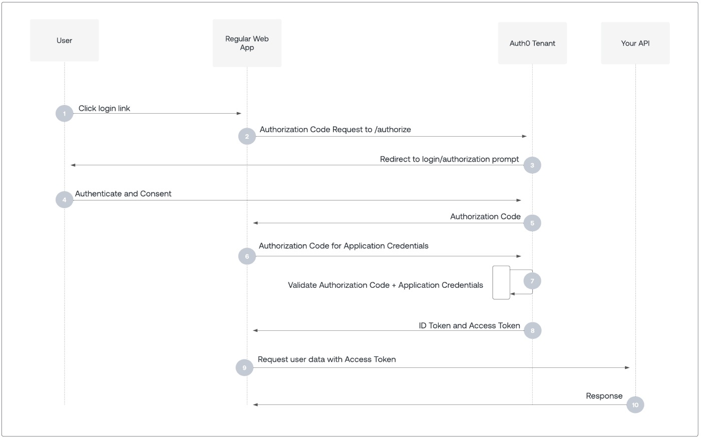
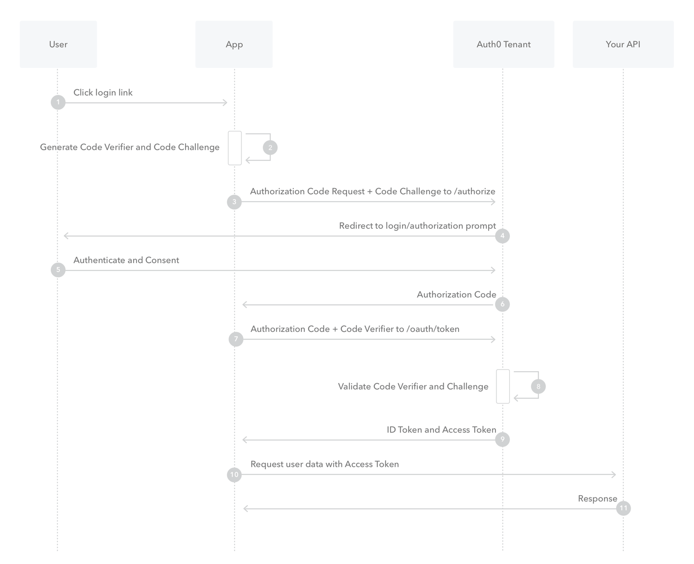

# Identity Provider - Void-Auth

## Resources:
1. [Authorization Code Flow](https://auth0.com/docs/get-started/authentication-and-authorization-flow/authorization-code-flow)
2. [Authorization Code Flow with Proof Key for Code Exchange (PKCE)](https://auth0.com/docs/get-started/authentication-and-authorization-flow/authorization-code-flow-with-pkce)
3. [Client Credentials Code Flow](https://auth0.com/docs/get-started/authentication-and-authorization-flow/client-credentials-flow)

## User/Admin interface

All users can access their account-specific information and security settings through the same interface.

The user and administrator interfaces are provided through the same endpoint. After logging in to VoidAuth, users see the functionality available to them based on their assigned role. Administrators additionally have access to administrative configuration options, including the configuration relevant to the Benjrm backend.

> Hint: In the example configuration provided with this project, Benjrm is configured entirely through environment variables. Therefore, the VoidAuth configuration used by Benjrm is immutable through the web UI. Configuration changes must instead be made through the environment configuration.

## Overview of the Authentication process from user perspective:
1. The user accesses the client-side web application and gets redirected to the login page after clicking the corresponding button.
2. On the login page, the user either enters their credentials to log in or clicks the "Register" link to create a new account. The user has the option to check the "Remember Me" checkbox to stay logged in between browser restarts until the session expires.
3. In case of forgotten credentials, the user can click the "Forgot Password?" link to initiate the password reset process, which will send a password reset email to the user's verified registered email address.
4. If the user clicks the "Register" link, they will be taken to the registration page where they can create a new account  by providing the required information such as username, email, and password. After successful registration, the user will receive a verification email to confirm their email address.

## Server-side Application of Benjrm
Uses **OpenID Connect (OIDC)** **Standard Flow (Authorization Code Flow) with PKCE (Proof Key for Code Exchange)** to authenticate users and obtain access tokens for accessing protected resources. The client is configured as a confidential client, which means it requires a client secret to authenticate.

---
#### 🔐 Authorization Code Flow with Proof Key for Code Exchange (PKCE) - Step-by-Step

##### 👉Authentication Code Flow Sequence Diagram:

[Authorization Code Flow - Further explanations](https://auth0.com/docs/get-started/authentication-and-authorization-flow/authorization-code-flow)

##### 👉Authentication Code Flow Sequence Diagram with Proof Key for Code Exchange (PKCE):

[Authorization Code Flow with Proof Key for Code Exchange (PKCE) - Further explanations](https://auth0.com/docs/get-started/authentication-and-authorization-flow/authorization-code-flow-with-pkce)
